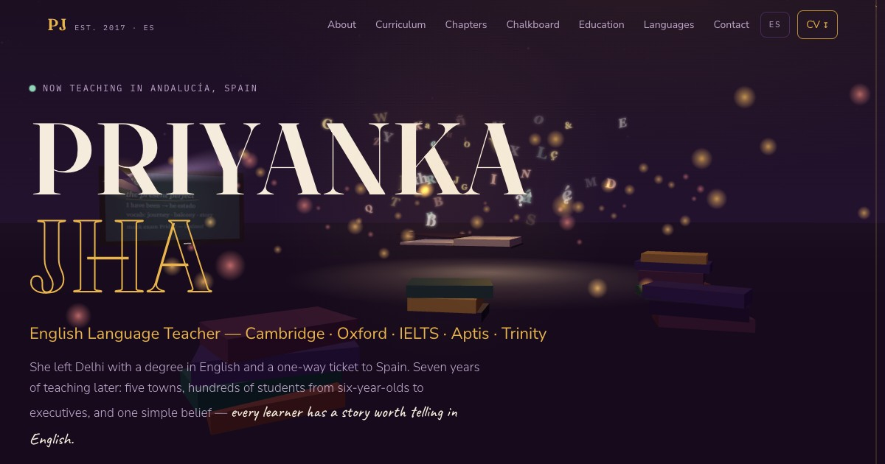

# ipjha.github.io

Portfolio of **Priyanka Jha** — English Language Teacher · Cambridge · Oxford · IELTS · Aptis · Trinity.

Live at **https://ipjha.github.io** · en español at **https://ipjha.github.io/es/**



A story-driven 3D site: a lamplit study where a storybook opens as the intro,
letters flutter out and orbit the page, and each résumé section reads as a
chapter — with a sketched map of her journey across Spain, a chalkboard that
writes itself, and a postcard for contact. Click the scene to startle the
letter-moths; type *hola* and see what they spell. Printing the page (Ctrl+P)
produces a clean one-page résumé.

## Run locally

```bash
python3 -m http.server 8000
# open http://localhost:8000
```

Plain HTML/CSS/JS — no build step. Three.js is vendored in `assets/vendor/`,
so the only external dependency is Google Fonts.
